# Customer Linkage — Data Model

## Entity Relationship Diagram

```mermaid
erDiagram
    EQUIP_contact {
        string  contact_code        PK  "Primary key"
        string  Business_Individual     "B=Business, I=Individual, C=BusinessContact"
        string  Inactive_Indicator      "A=Active, I=Inactive, null=Active"
        int     Ckc_Id                  "B+I: own Entity ID | C: parent Business Entity ID"
        int     Cmp_Ckc_Id              "C-type only: own Registry Contact ID"
    }

    EQUIP_ArMaster {
        int     ACC_NO              PK  "Customer account number — PK (Fabric-verified name)"
        string  contact_code        FK  "-> EQUIP_contact.contact_code (nullable in Fabric)"
        numeric CREDIT_LIMIT            "Max outstanding balance allowed"
        string  Credit_Status           "Open or Closed"
        string  CREDIT_TERM             "Cash, 30, 60, or 90 days"
        numeric CURRENT_VALUE           "Current amount owing within credit terms"
        numeric YTD_DEBITS              "Year-to-date sales"
        numeric YTD_CREDITS             "Year-to-date payments and returns"
        string  In_House_Account_IND    "Undocumented flag — not in schema CSV"
    }

    EQUIP_ArMaster_Customer {
        string  contact_code        FK  "-> EQUIP_contact.contact_code (nullable in Fabric)"
        int     BILL_TO_ACC             "Account transactions post to — = ArMaster.ACC_NO (nullable in Fabric)"
        int     Customer_No             "Alternate account ref; = BILL_TO_ACC on 99.996% of rows (verified)"
        string  TERRITORY               "3-char branch/territory code — branch dimension source"
        string  ACC_TYPE                "Account type: Parts/Svc, Vehicle, Contract, Trust"
        string  TRADE_TYPE              "Cash, Dealer, Internal, Retail, Trade, Warranty"
        string  STATUS_CODE             "Type Code Maintenance SC"
        string  In_House_Account_IND    "Undocumented flag — not in schema CSV"
    }

    EQUIP_WKMECHFL {
        string  Code                PK  "= contact_code (service technician)"
        string  is_terminated           "Y/N"
    }

    EQUIP_VhSalman {
        string  CODE                PK  "= contact_code (salesperson)"
        string  Is_Terminated           "Y/N"
    }

    DDP_customer_cross_ref {
        string  cross_ref_number    FK  "= contact_code"
        int     entity_id               "Registry Entity ID"
        int     contact_id              "Registry Contact ID (Business Contacts only, else 0/null)"
    }

    DDP_customer_profile {
        int     entity_id           PK  "Registry Entity ID"
        int     contact_id              "Registry Contact ID"
        string  out_of_busn_ind         "Y/N"
        string  descd_ind               "Y/N"
        string  cross_ref_description       "Source of the linkage — filter required (see below)"
    }

    Salesforce_Account {
        string  Id                  PK  "Salesforce record ID"
        int     Anvil__AccountNumber__c     FK  "= EQUIP_ArMaster.Acc_No (Customers only)"
        string  RecordTypeId                    "Customer or Prospect"
        int     Anvil__CustomerCompEntityID__c  "Entity ID from quote workflow (Anvil/JDQuote2)"
        int     H_Equip_contact_Ckc_Id__c       "Entity ID synced from EQUIP (overwrites Anvil field)"
    }

    EQUIP_contact           ||--o|  EQUIP_ArMaster           : "contact_code = CONTACT_CODE (nullable in ArMaster)"
    EQUIP_contact           ||--||  EQUIP_ArMaster_Customer  : "contact_code = CONTACT_CODE | 1:1 confirmed"
    EQUIP_ArMaster          ||--||  EQUIP_ArMaster_Customer  : "ACC_NO = BILL_TO_ACC"
    EQUIP_contact           ||--o|  DDP_customer_cross_ref   : "contact_code = cross_ref_number"
    EQUIP_contact           ||--o|  EQUIP_WKMECHFL           : "contact_code = Code | technicians"
    EQUIP_contact           ||--o|  EQUIP_VhSalman           : "contact_code = CODE | salespersons"
    DDP_customer_cross_ref  }o--||  DDP_customer_profile     : "entity_id"
    EQUIP_ArMaster          ||--o|  Salesforce_Account       : "Acc_No = Anvil__AccountNumber__c"
```



---

## Cardinality Notes

| Relationship | Cardinality | Notes |
|---|---|---|
| EQUIP_contact → EQUIP_ArMaster | **1:0..1** | `CONTACT_CODE` is nullable in `ArMaster` — not all AR master records are guaranteed to have a contact. Used for financial/balance data. |
| EQUIP_contact → EQUIP_ArMaster_Customer | **1:1** | `CONTACT_CODE` is NOT NULL. Confirmed across all 524,971 accounts. This is the primary contact→account join table. |
| EQUIP_ArMaster → EQUIP_ArMaster_Customer | **1:1** | Join: `ArMaster.ACC_NO = ArMaster_Customer.BILL_TO_ACC`. `Customer_No` equals `BILL_TO_ACC` on 99.996% of rows (525,180 / 525,203) — 23 consolidated-billing exceptions. Current query joins on `Customer_No`; negligible impact. |
| EQUIP_contact → DDP_customer_cross_ref | **1:0..1** | A contact may or may not be formally linked. Each contact_code appears at most once in cross_ref. |
| EQUIP_contact → EQUIP_WKMECHFL | **1:0..1** | 1,787 technician records; 1,768 (99%) join to a contact. `Code` = contact_code. Exclude from all upload queries. |
| EQUIP_contact → EQUIP_VhSalman | **1:0..1** | 2,468 salesperson records; 2,435 (99%) join to a contact. `CODE` = contact_code. Exclude from all upload queries. |
| DDP_customer_cross_ref → DDP_customer_profile | **N:1** | Multiple EQUIP contacts can link to the same Registry entity (603 cases confirmed — these are duplicates in EQUIP). `customer_profile` rows are also keyed by `cross_ref_description` — always filter to `'HUTSON INC Dealer XREF'` to avoid duplicate rows from EDA source (see convention rule 12). |
| EQUIP_ArMaster → Salesforce_Account | **1:0..1** | Salesforce Customer records sync from EQUIP. Not all EQUIP accounts have a Salesforce record. Prospect accounts have no account number and no EQUIP record. |

---

## Equip.ArMaster — Column Reference

Source: `source-materials/Equip ArMaster Schema.csv`. Fabric-verified 2026-05-08.

**Fabric notes:** All columns show `IS_NULLABLE = YES` in Fabric regardless of source constraints — this is normal lakehouse behavior. Column names match CSV except: `Acc_No` (CSV) → `ACC_NO` (Fabric); `CREDIT_STATUS` (CSV) → `Credit_Status` (Fabric). One undocumented column in Fabric not in CSV: `In_House_Account_IND`.

**Role:** Financial master record for each AR account. Holds the primary account number (`ACC_NO`), aging balances, credit terms, and payment history. Joins to Salesforce via `Anvil__AccountNumber__c = ACC_NO`.

| Column | Type | Nullable | Description |
|---|---|---|---|
| `ACC_NO` | int | Y (PK) | Customer account number — primary key. Matches Salesforce `Anvil__AccountNumber__c`. |
| `contact_code` | varchar | Y | FK to `Equip.contact.contact_code`. Nullable in Fabric. |
| `CREDIT_LIMIT` | numeric | Y | Maximum outstanding balance allowed on the account. |
| `CREDIT_STATUS` | char(1) | Y | Open or Closed. |
| `CREDIT_TERM` | char(1) | Y | Payment terms: Cash, 30, 60, or 90 days. |
| `CURRENT_VALUE` | numeric | Y | Current amount owing within credit terms. |
| `BAL_FORWARD` | numeric | Y | Opening balance of the current month. |
| `DAYS_30` | numeric | Y | Amounts owing from last month (30-day aging bucket). |
| `DAYS_60` | numeric | Y | Amounts owing from 2 months ago. |
| `DAYS_90` | numeric | Y | Amounts owing from 3+ months ago. |
| `DAYS_120` | numeric | Y | Amounts owing 120+ days — severely overdue. |
| `YTD_DEBITS` | numeric | Y | Year-to-date sales on this account. |
| `YTD_CREDITS` | numeric | Y | Year-to-date payments and returns. |
| `LYTD_DEBITS` | numeric | Y | Last year-to-date sales (prior fiscal year). |
| `LYTD_CREDITS` | numeric | Y | Last year-to-date payments and returns. |
| `DATE_LAST_PAY` | timestamp | Y | Date of most recent payment received. |
| `LAST_AMOUNT_PAY` | numeric | Y | Amount of most recent payment. |
| `Pay_Method` | char(20) | Y | Default payment method: Account, Cash, Check, Credit Card, Finance. |
| `PRINT_STATEMENT` | char(1) | Y | Y/N — whether to generate periodic statements. |
| `PRINT_DAYS` | integer | Y | Statement frequency: 30 (monthly) or 7 (weekly). |
| `STATEMENT_TYPE` | char(1) | Y | Open Item (individual invoices retained) or Balance Forward. |
| `distribution_method` | char(1) | Y | Statement delivery: Postage, Email, or Fax. |
| `BANK` | char(50) | Y | Customer's financial institution name. |
| `BANK_ACC` | char(15) | Y | Customer's bank account number. |
| `BANK_BRANCH` | char(20) | Y | Bank branch number. |
| `Rental_Credit_Limit` | numeric | Y | Separate credit limit for rental transactions. |
| `Rental_Discount_Percentage` | numeric | Y | Discount applied to rental rates. |
| `CREDIT_MESSAGE` | char(40) | Y | Message printed on customer statements. |
| `user_field1`–`user_field4` | char(10) | Y | User-defined fields for custom reporting. |
| `Creation_Date` | timestamp | Y | AR master record created timestamp. |
| `Last_Modified_Date` | timestamp | Y | AR master record last modified timestamp. |
| `CreatedBy` / `CreatedByApp` | char/varchar | Y | User and application that created the record. |
| `ModifiedBy` | char(20) | Y | User that last modified the record. |

---

## Equip.ArMaster_Customer — Column Reference

Source: `source-materials/Equip ArMaster_Customer Schema.csv`. Fabric-verified 2026-05-08.

**Fabric notes:** All columns nullable in Fabric (lakehouse behavior). `CONTACT_CODE` (CSV) → `contact_code` (Fabric). One undocumented column not in CSV: `In_House_Account_IND`. `Customer_No` = `BILL_TO_ACC` on 525,180 / 525,203 rows (99.996%) — 23 consolidated-billing exceptions, negligible impact on existing query joins.

| Column | Type | Length | Nullable | Description |
|---|---|---|---|---|
| `BILL_TO_ACC` | integer | 4 | **N** | The account number all transactions post to. Defaults to `Customer_No` but can differ for consolidated billing. Likely the `ACC_NO` that syncs to Salesforce `Anvil__AccountNumber__c`. |
| `Customer_No` | integer | 4 | Y | Alternate account reference number. Used in existing queries to join `Invoice.bill_to_acc` — see note below. |
| `CONTACT_CODE` | char | 15 | **N** | FK to `Equip.contact.contact_code`. Join key for all contact enrichment. |
| `TERRITORY` | char | 3 | Y | Branch/territory code. **This is the branch dimension field** — it is on `ArMaster_Customer`, not on `Equip.contact`. Join `ArMaster_Customer` to get it. |
| `ACC_TYPE` | char | 1 | Y | Account type: Parts & Service (default), Vehicle, Contract, Trust. |
| `TRADE_TYPE` | char | 1 | Y | Customer tier: Cash, Dealer, Internal, Retail, Trade, Warranty. |
| `STATUS_CODE` | char | 1 | Y | Customer status; codes maintained in Type Code Maintenance (SC). |
| `DISC_TYPE` | char | 2 | Y | Discount class for Special Pricing Parts. |
| `PRICE_LEVEL` | char | 1 | Y | Default price level (1–4, Cost, List). |
| `PRICE_PERCENT` | numeric | 6 | Y | Price adjustment %: positive = markup, negative = discount. |
| `LABOUR_RATE` | numeric | 12 | Y | Default hourly service labor rate for this customer. |
| `TAX_EXEMPT_NO` | char | 16 | Y | Tax exemption number. |
| `Tax_Exempt_Type` | char | 15 | Y | Tax exempt type (Type Code Maintenance — code TBD). |
| `QUOTE_PURCH_ORD` | char | 1 | Y | Y = PO number required on Parts/Service sales. |
| `CreationDate` | timestamp | — | Y | AR customer record created timestamp. |
| `ModifiedDate` | timestamp | — | Y | AR customer record last modified timestamp. |
| `NOTE` | varchar | 32767 | Y | Free-text notes on the account. |
| `alert` | varchar | 4000 | Y | Alert text displayed in SysNotes when customer is selected. |
| `customer_no_char` | char | 15 | Y | Computed column — `Customer_No` cast to char to avoid runtime casting. |

### BILL_TO_ACC vs Customer_No

These two columns serve different purposes and may differ for customers with consolidated billing:

- **`BILL_TO_ACC`** (NOT NULL): The account that actually receives all transaction postings. The "true" billing account. This is what syncs to Salesforce as `Anvil__AccountNumber__c`.
- **`Customer_No`** (nullable): An alternate reference number. Current queries join `Invoice.bill_to_acc = am.Customer_No`, which may not capture all revenue for consolidated-billing accounts where `Customer_No ≠ BILL_TO_ACC`.

**Action needed:** Verify whether `Customer_No` and `BILL_TO_ACC` differ on any accounts in Fabric before relying on the revenue rollup in staleness/decile queries.

### TERRITORY — Branch Field

`TERRITORY` (char 3) on `ArMaster_Customer` is the branch dimension field. It is **not** on `Equip.contact`. The data quality plan and snapshot spec assumed branch was on `Equip.contact` — this is incorrect.

Since `active_contacts` in the combined snapshot query already LEFT JOINs `ArMaster_Customer` for `acc_no`, adding `am.TERRITORY` to the SELECT resolves the branch open question with no additional joins.

Contacts with no `ArMaster_Customer` record (no account) will have `TERRITORY = NULL` → map to `'No Account'` or `'ALL'` in the snapshot.

---

## Conditional Field Semantics — Ckc_Id and Cmp_Ckc_Id

The meaning of `Ckc_Id` and `Cmp_Ckc_Id` on `EQUIP_contact` depends on `Business_Individual`:

```
Business_Individual = 'B' (Business)
    Ckc_Id      → own Registry Entity ID
    Cmp_Ckc_Id  → not used

Business_Individual = 'I' (Individual)
    Ckc_Id      → own Registry Entity ID
    Cmp_Ckc_Id  → not used

Business_Individual = 'C' (Business Contact)
    Ckc_Id      → PARENT Business's Registry Entity ID
    Cmp_Ckc_Id  → own Registry Contact ID
```

Confirmed at 96–99% match rate against `DDP_customer_cross_ref` (block 2c-revised).

---

## Registry Customer Type Model

In John Deere's Registry, Businesses and their Contacts share the same Entity ID.
The Contact ID uniquely identifies the individual within the business.

```
Registry
├── Business (Entity ID: 501065658)
│   ├── Business Contact: MICKEY SMITH (Entity ID: 501065658, Contact ID: 105263458)
│   └── Business Contact: JOHN SMITH   (Entity ID: 501065658, Contact ID: 105263459)
└── Individual: JACK KEAN (Entity ID: 587894325)
```

This is why `EQUIP_contact` type-C records have `Ckc_Id` = parent Business Entity ID:
they share that Entity ID with the Business record in Registry.

---

## DDP.customer_profile — cross_ref_description Values

As of 2026-05-01, John Deere added a `cross_ref_description` field to `DDP.customer_profile`. The field identifies the source system that created the linkage. Known values:

| Value | Source | Notes |
|---|---|---|
| `HUTSON INC Dealer XREF` | EQUIP → Registry (this project) | Hutson's formal dealer cross-references |
| `EDA UCC-1 BUYERS` | EDA dataset (edadata.com) | New as of 2026-05-01; EDA not yet loaded in Fabric |

**Query impact:** Without filtering on `cross_ref_description`, the same entity_id + contact_id row appears twice — once per source. All joins to `customer_profile` must filter on `cross_ref_description = 'HUTSON INC Dealer XREF'` to prevent fan-out (see query convention rule 12).

---

## Salesforce Entity ID Field Precedence

```
Anvil__CustomerCompEntityID__c   ← set by JDQuote2/JDSC quote sync
                                    (how Prospects get entity IDs without being in EQUIP)
        ↓ overwritten when populated
H_Equip_contact_Ckc_Id__c        ← synced from EQUIP formal Registry linkage
                                    (authoritative — overwrites Anvil field)
```

Creating formal EQUIP linkages will automatically correct stale Anvil-sourced
entity IDs on Salesforce Customer records through the normal sync.
