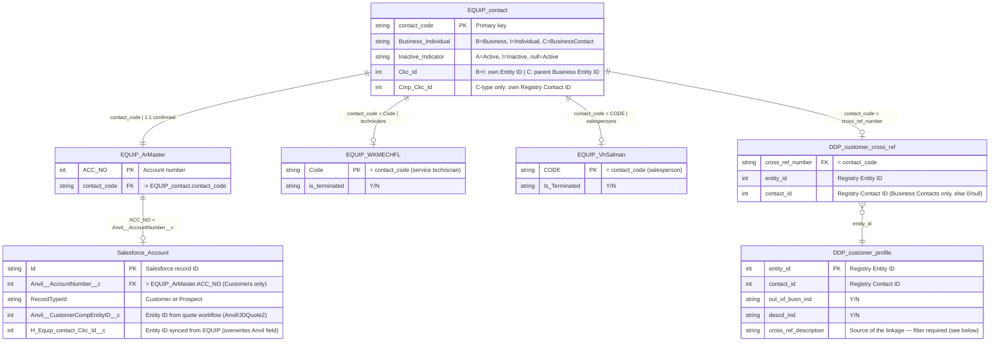

# Customer Linkage — Data Model

## Entity Relationship Diagram



---

## Cardinality Notes

| Relationship | Cardinality | Notes |
|---|---|---|
| EQUIP_contact → EQUIP_ArMaster | **1:1** | Confirmed across all 524,971 accounts. Every account has exactly one contact code. |
| EQUIP_contact → DDP_customer_cross_ref | **1:0..1** | A contact may or may not be formally linked. Each contact_code appears at most once in cross_ref. |
| EQUIP_contact → EQUIP_WKMECHFL | **1:0..1** | 1,787 technician records; 1,768 (99%) join to a contact. `Code` = contact_code. Exclude from all upload queries. |
| EQUIP_contact → EQUIP_VhSalman | **1:0..1** | 2,468 salesperson records; 2,435 (99%) join to a contact. `CODE` = contact_code. Exclude from all upload queries. |
| DDP_customer_cross_ref → DDP_customer_profile | **N:1** | Multiple EQUIP contacts can link to the same Registry entity (603 cases confirmed — these are duplicates in EQUIP). `customer_profile` rows are also keyed by `cross_ref_description` — always filter to `'HUTSON INC Dealer XREF'` to avoid duplicate rows from EDA source (see convention rule 12). |
| EQUIP_ArMaster → Salesforce_Account | **1:0..1** | Salesforce Customer records sync from EQUIP. Not all EQUIP accounts have a Salesforce record. Prospect accounts have no account number and no EQUIP record. |

---

## Conditional Field Semantics — Ckc_Id and Cmp_Ckc_Id

The meaning of `Ckc_Id` and `Cmp_Ckc_Id` on `EQUIP_contact` depends on `Business_Individual`:

```
Business_Individual = 'B' (Business)
    Ckc_Id      → own Registry Entity ID
    Cmp_Ckc_Id  → not used

Business_Individual = 'I' (Individual)
    Ckc_Id      → own Registry Entity ID
    Cmp_Ckc_Id  → not used

Business_Individual = 'C' (Business Contact)
    Ckc_Id      → PARENT Business's Registry Entity ID
    Cmp_Ckc_Id  → own Registry Contact ID
```

Confirmed at 96–99% match rate against `DDP_customer_cross_ref` (block 2c-revised).

---

## Registry Customer Type Model

In John Deere's Registry, Businesses and their Contacts share the same Entity ID.
The Contact ID uniquely identifies the individual within the business.

```
Registry
├── Business (Entity ID: 501065658)
│   ├── Business Contact: MICKEY SMITH (Entity ID: 501065658, Contact ID: 105263458)
│   └── Business Contact: JOHN SMITH   (Entity ID: 501065658, Contact ID: 105263459)
└── Individual: JACK KEAN (Entity ID: 587894325)
```

This is why `EQUIP_contact` type-C records have `Ckc_Id` = parent Business Entity ID:
they share that Entity ID with the Business record in Registry.

---

## DDP.customer_profile — cross_ref_description Values

As of 2026-05-01, John Deere added a `cross_ref_description` field to `DDP.customer_profile`. The field identifies the source system that created the linkage. Known values:

| Value | Source | Notes |
|---|---|---|
| `HUTSON INC Dealer XREF` | EQUIP → Registry (this project) | Hutson's formal dealer cross-references |
| `EDA UCC-1 BUYERS` | EDA dataset (edadata.com) | New as of 2026-05-01; EDA not yet loaded in Fabric |

**Query impact:** Without filtering on `cross_ref_description`, the same entity_id + contact_id row appears twice — once per source. All joins to `customer_profile` must filter on `cross_ref_description = 'HUTSON INC Dealer XREF'` to prevent fan-out (see query convention rule 12).

---

## Salesforce Entity ID Field Precedence

```
Anvil__CustomerCompEntityID__c   ← set by JDQuote2/JDSC quote sync
                                    (how Prospects get entity IDs without being in EQUIP)
        ↓ overwritten when populated
H_Equip_contact_Ckc_Id__c        ← synced from EQUIP formal Registry linkage
                                    (authoritative — overwrites Anvil field)
```

Creating formal EQUIP linkages will automatically correct stale Anvil-sourced
entity IDs on Salesforce Customer records through the normal sync.
